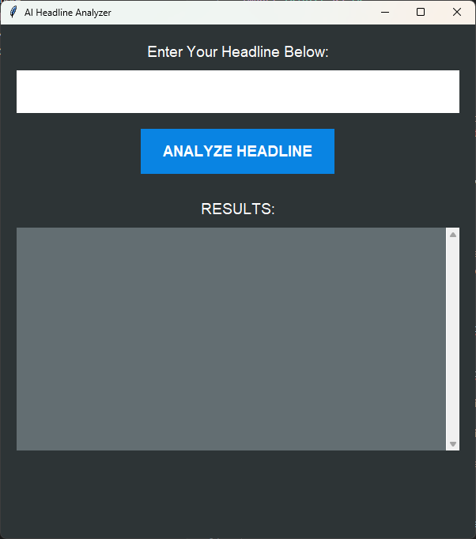

# AI Headline Analyzer

A Python GUI application that analyzes headlines using NLP and marketing principles.



## Features
- Sentiment analysis (Positive/Negative/Neutral with score)
- Word and character count
- Key noun extraction
- Power word detection
- Urgency word detection

## Requirements
- Python 3.x
- textblob (`pip install textblob`)
- NLTK corpora (`python -m textblob.download_corpora`)

## Installation
1. Clone this repository
2. Install dependencies: `pip install textblob`
3. Download NLTK corpora: `python -m textblob.download_corpora`

## Usage
Run the application: `python headline_analyzer.py`

Enter a headline in the input field and click "ANALYZE HEADLINE" to see the results.

## Example Output
```
-> Sentiment: Positive (Score: 0.85)
-> Word Count: 7
-> Character Count: 42
-> Key Nouns: Python, GUI, App
-> Power Words: Amazing, You
-> Urgency Words: Now